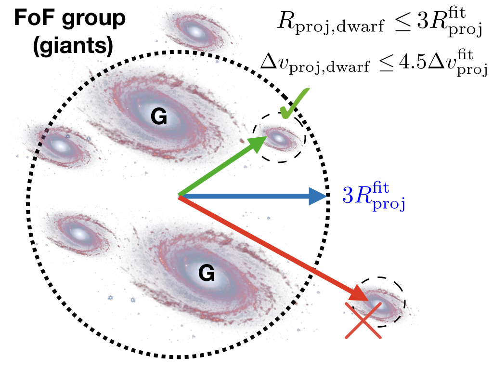
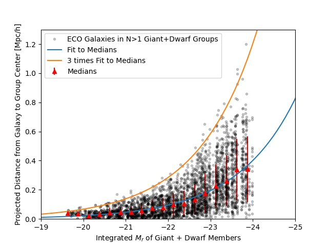
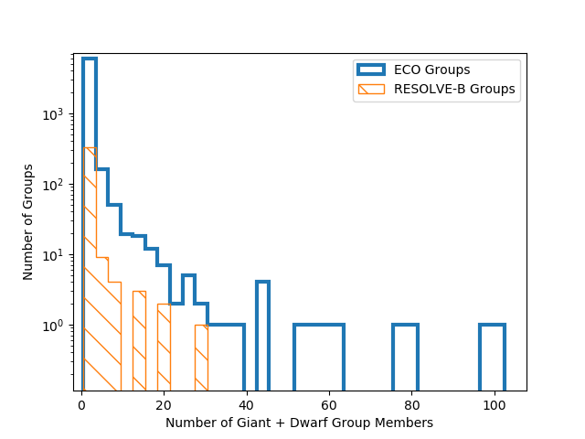

# RESOLVE-G3 (Gas in Galaxy Groups) Group Finding Algorithm and Catalogs

This git repository stores the codes and group catalogs for the RESOLVE-G3 (Gas in Galaxy Groups) initiative. RESOLVE already contains a conventional group catalog (Eckert+ 2016, 2017) produced with friends-of-friends and halo abundance matching (HAM). However, as the choice of group finder inherently defines the volume for detecting and summing gas, we have carefully devised a new group finding technique for G3. This algorithm has also been designed with the intent to be compatible with other surveys that are not complete into the dwarf galaxy regime, for which techniques such as HAM are not consistently transferrable. The panels below describe our three-step, iterative algorithm and provide information on using the galaxy catalogs.

## Using the Group Data

We provide galaxy catalogs containing group information from three group-finding selection criteria: a luminosity-selected group catalog, a stellar mass-selected group catalog, and a baryonic mass-selected (M* + 1.4MHI) group catalog. In addition to the names of variables standard in the RESOLVE and ECO databases, the following columns describe the new groups:

* `g3grp_*`: group ID number of galaxy following the group idenitification procedure described below.
* `g3grpngi_*`: number of giant galaxies in group (from step 1 below). If `g3grpngi_*=0`, it is a dwarf-only group.
* `g3grpndw_*`: number of dwarf galaxies in group (from steps 2 or 3 below). The total number of group numbers can be calculated as `grpngi_* + grpndw_*`.  
* `g3grpradeg_*`: right-ascension of group center in decimal degrees
* `g3grpdedeg_*`: declination of group center in decimal degrees
* `g3grpcz_*`: Local Group-corrected velocity of group center in km/s
* `g3logmh_*`: abundance-matched log halo mass (m280b) assuming h=0.7
* `g3r337_*`: theoretical group virial radius, in arcseconds, from halo mass (337b convention, i.e. NOT r280b)
* `g3rproj_*`: observational group projected radius, in arcseconds, calculated as 75th percentile radius of giant and dwarf members
* `g3router_*`: distance to outermost group member, in arcseconds, from the group center
* `g3fc_*`: 1/0 central flag, defined as the most luminous or massive group galaxy.
* `g3grplogG_*`: group-integrated gas mass
* `g3grplogS_*`: group-integrated stellar mass
* `g3grpadAlpha_*`: Anderson-Darling test statistic, measuring virialization level (computed for N>6 groups)
* `g3grptcross_*`:  Crossing of time of group in Gyr, computed as the average projected spatial radius per average peculiar velocity
* `g3grpcolorgap_*`: The u-r color gap of the group, i.e. the difference in u-r color of the brightest and second brightest galaxies, selected in absolute r-magnitude.
* `g3grpdsProb_*`: p-value from Dressler-Schectman test for groups with N>10; low p-values are indicative of subclustering and thus lower virialization. 

The wildcard `*` must be replaced with `l`, `s`, or `b` to indicate your choice of group catalog - luminosity, stellar, or baryonic selected. All variables are set to -99 if the galaxy was not included in group finding.

Note: Positions of group centers -- `g3grpradeg`, `g3grpdedeg`, `g3grpcz` -- are calculated by establishing Cartesian coordinates for each galaxy member based on their individual Local-Group corrected `cz`. The group center is calculated in Cartesian coordinates, averaging (unweighted) the `x`,`y`,`z` values of each giant or dwarf group member. The group center in Cartesian coordinates is then translated back to RA, declination, and redshift. 

## Step 1: Finding Giant-Only Cores of Groups

In the first step of the group finder, we use friends-of-friends (FoF)  to locate groups of giant galaxies. We place our definition of the giant-dwarf divide at the cusp in the <a href="images/dwarfgiantdivide_stellar.jpg">M*-L relation</a>, which occurs at log stellar mass ~9.5. This mass is approximately equal to the gas-richness threshold scale in stellar mass (Eckert+ 2016). For baryonic mass, we look at the <a href="images/dwarfgiantdivide_baryonic.jpg">correlation between r-band luminosity and baryonic mass </a>, and divide dwarfs from giants at its intersection with `M_r = -19.4` (which defined the M*-L cusp).

Therefore our selection criteria for giant-only FoF are:

* Luminosity-selected ECO/RESOLVE-A: `M_r<=-19.4`, `2530 < cz [km/s] < 7470`
* Luminosity-selected RESOLVE-B: `M_r<=-19.4`, `4250 < cz [km/s] < 7250` 
* Stellar mass-selected ECO/RESOLVE-A: `log(Mstar)>=9.5`, `2530 < cz [km/s] < 7470`
* Stellar mass-selected RESOLVE-B: `log(Mstar)>=9.5`, `4250 < cz [km/s] < 7250`
* Baryonic mass-selected ECO/RESOLVE-A: `log(Mbary)>=9.9`, `2530 < cz [km/s] < 7470`
* Baryonic mass-seleted RESOLVE-B: `log(Mbary)>=9.9`, `4250 < cz [km/s] < 7250`

We employ an adaptive linking strategy during this giant-only FoF procedure, inspired by Robotham et al. (2011) and its volume-limited application in Mummery (2018, PhD thesis). We use line-of-sight bLOS and transverse b&#8869; linking multipliers of 1.1 and 0.07, respectively, as these are optimized for the study of galaxy environment (Duarte & Mamon, 2014). In a standard FoF approach, these values are multiplied by the mean separation of galaxies, s0=(V/N)1/3, and are used as linking lengths. In our approach, we assign linking lengths as the minimum of the s0 and ai. The ai is an adaptive separation parameter based on the cumulative number density distribution of giant galaxies above a given luminosity or mass. It rises with galaxy luminosity/mass, and therefore the lowest mass galaxies get the smallest separation parameters. For the lowest giant galaxy in the sample, ai is approximately equal to 0.75s0. Using the mocks, we find this reduces unphysical over-merging of lower mass halos into larger ones.

At the end of step 1, we have a set of giant-only groups. All dwarfs have yet to be tested for group membership. The figure below shows the multiplicity function for these giant-only groups, based on the luminosity-selected catalog.

 

## Step 2: Associating Dwarf Galaxies to Giant-Only Groups

The next step is to associate dwarf galaxies into the giant-only groups. To make this algorithm compatible with surveys that are incomplete into the dwarf regime, we must avoid halo mass estimates in those datasets. Therefore, we use the individual relative (to group center)  projected radii and peculiar velocities of ECO giant galaxies to calibrate search boundaries for dwarfs. This calibration is obtained by fitting a curve to the outermost galaxy radii in bins of giant-only group N, and comparing this curve to the expected virial radii in ECO, for which we *know* is dwarf-complete. This calibration is shown in the plot below, and while a similar calibration is done in velocity, it is not shown here for brevity. We also note that this calibration is done separately for each group-finding sample, as the giant-only FoF groups are slightly different for each selection.

The fit to medians, binned by giant-only group N, of the projected radii and velocities are shown in the blue line. The green dash-dotted line shows the optimal radii for associating dwarf galaxies, 3Rprojfit (or 4.5vprojfit in velocity), because it is the radius that would enclose nearly-all giant galaxies if their groups were stacked at fixed N. Therefore, if a dwarf galaxy falls within  3Rprojfit and 4.5vprojfit of a giant-only FoF group, we associate the dwarf as a group member. The cartoon below illustrates this concept. With this calibration from ECO in hand, we can apply it to other surveys for which the halo mass information does not exist. 

## Step 3: Finding Dwarf-Only Groups

With dwarf galaxies now associated to giant-only groups, we have a catalog of "giant+dwarf" groups, and the remaining step in the group finder is to search for dwarf-only groups -- groups that would have been missed because they do not contain a giant galaxy to be associated with. We have written an algorithm called "iterative combination" to perform this step. This algorithm uses an iterative approach, trying to merge nearest-neighbor pairs of "potential groups" based on the sizes of similarly-luminous (or similarly-massive)  giant+dwarf groups. The steps of this algorithm are:

 1. Assign all ungrouped dwarfs (following step 2: association) to N=1 "potential" groups.
 2. Use a k-d tree to identify pairs of nearest-neighbor potential groups.
 3. For every nearest-neighbor pair, check if the pair should be merged into a single group:
*  Depending on the group finding selection, compute the integrated r-band absolute magnitude, integrated stellar mass, or integrated baryonic mass  of all member galaxies belonging to the pair.
*  Compute the maximal sizes (projected radii and velocities) of galaxies belonging to giant+dwarf groups of similar integrated luminosity or mass. These values are drawn from a fit to the median projected radii and velocities of giant+dwarf group galaxies as a function of integrated mass/luminosity. The fit is then scaled by 3 and 4.5, respectively, to assess the "maximal" size. The fits are shown below. 
      
* If all individual galaxies shared between the two potential groups can fit within those radii/velocities, we merge them together into a single group.
 4. Repeat from (2) until the dwarf-only group catalog has converged, when the potential groups are no longer merging between iterations.

After iterative combination has finished, we have a complete set of groups. The multiplicity function for luminosity-selected groups in ECO and RESOLVE-B is shown below.

## Assigning Halo Masses

Now that groups are identified, we assign halo masses based on group-integrated luminosity or stellar mass, using the theoretical mass function of Tinker et al. (2008). Despite the fact that this algorithm has been designed to *avoid* halo abundance matching, we are still able to reliably apply HAM to ECO and RESOLVE, because we know them to be complete and volume-limited. The results of abundance matching are shown in the figure below. To assign halo masses for RESOLVE-B, we performed abundance matching on a RESOLVE-B analog version ECO which extends down to the deeper completeness floor of RESOLVE-B, and then interpolated from that result. For surveys that are incomplete in the dwarf regime, we will be able to use the halo mass-group luminosity relation from ECO to estimate group masses.

