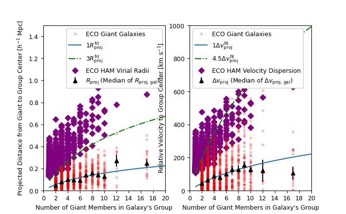

# RESOLVE-G3 (Gas in Galaxy Groups) Group Finding Algorithm and Catalogs

Intro first paragraph...

## Using the Group Catalogs

Click for details...

## Step 1: Finding Giant-Only Cores of Groups

In the first step of the group finder, we use friends-of-friends (FoF)  to locate groups of giant galaxies. We define giants as galaxies that are  more massive than the gas-richness threshold scale from Kannappan et al. (2013). Therefore our selection criteria for giant-only FoF are:

* Luminosity-selected ECO/RESOLVE-A: `M_r<=-19.4`, `2530 < cz [km/s] < 7470`
* Luminosity-selected RESOLVE-B: `M_r<=-19.4`, `4250 < cz [km/s] < 7250` 
* Stellar mass-selected ECO/RESOLVE-A: `log(Mstar)>=9.5`, `2530 < cz [km/s] < 7470`
* Stellar mass-selected RESOLVE-B: `log(Mstar)>=9.5`, `4250 < cz [km/s] < 7250`

We employ an adaptive linking strategy during this giant-only FoF procedure, inspired by Robotham et al. (2011) and its volume-limited application in Mummery (2018). We use line-of-sight `b_LOS` and transverse `b_perp` linking multipliers of 1.1 and 0.07, respectively, as these are optimized for the study of galaxy environment (Duarte & Mamon, 2014). In a standard FoF approach, these values are multiplied by the mean separation of galaxies, `s_0=(V/N)^1/3`, and are used as linking lengths. Here we assign a different value of `s` to every galaxy, measured instead by the number density of galaxies which are greater than or equal to their luminosity or mass. We then look at the median value of `s` over all galaxies and scale all `s` values such that the median is retained at the original `(V/N)^1/3`. The figure below shows how the value of `s` varies with absolute magnitude. We apply these ECO `s` values to RESOLVE-B using a model fit, since the B semester volume is subject to cosmic variance. This approach ensures that the linking length rises with galaxy luminosity/stellar mass and therefore reduces fragmentation of identified groups.

At the end of step 1, we have a set of giant-only groups. All dwarfs have yet to be tested for group membership. The figure below shows the multiplicity function for these giant-only groups, based on the luminosity-selected catalog.

 

## Step 2: Associating Dwarf Galaxies to Giant-Only Groups

The next step is associate dwarf galaxies into the giant-only groups. To do so, we use the individual relative projected radii and peculiar velocities of giants to calibrate search boundaries for dwarfs. The figure below shows this calibration as a function of giant-only group N, allowing us to avoid halo mass estimates (which are problematic for high-z LADUMA work). An analagous calibration is done in velocity, but it is not shown here for brevity.

The fit to medians, binned by giant-only group N, of the projected radii and velocities are:

Rprojfit = 0.0177Ngiants + 0.0546 [Mpc/h]

vprojfit = 7.558Ngiants + 40.060 [km/s]

We find that optimal values for associating dwarfs are 3Rprojfit and 4.5vprojfit. These scale factors raise the fit to the radii (or velocity boundaries) that would have enclosed nearly-all giant galaxies at a given giant-only group N. Therefore, we associate dwarf galaxies to the giant-only groups within these boundaries. A cartoon diagram is shown below to illustrate this concept, as well as the multiplicity function for groups containing giants and dwarfs.

## Step 3: Finding Dwarf-Only Groups

With dwarf galaxies now associated to giant-only groups, we have a catalog of "giant+dwarf" groups, and the remaining step in the group finder is to search for dwarf-only groups -- groups that would have been missed because they do not contain a giant galaxy to be associated with. We have written an algorithm called "iterative combination" to perform this step, which is contained in the `iterativecombination.py` file. This algorithm uses an iterative approach, trying to merge nearest-neighbor pairs of "potential groups" based on the sizes of similarly-luminous giant+dwarf groups. The steps of this algorithm are:

 1. Assign all ungrouped dwarfs (following step 2: association) to N=1 "potential" groups.
 2. Use a k-d tree to identify pairs of nearest-neighbor potential groups (i.e., a pair of potential groups where each group is a NN to the other).
 3. For every nearest-neighbor pair, check if the pair should be merged into a single group:
  * a. Compute the integrated r-band absolute magnitude of all member galaxies belonging to the pair.
  * b. Determine the ~98th percentile of individual galaxy projected radii and peculiar velocities, `r_proj` and `dv_proj`, observed in giant+dwarf groups (identified in step 2) of the same group-integrated luminosity.
  * c. If all individual galaxies shared between the nearest-neighbor of potential groups can fit within the boundaries `r_proj` and `dv_proj`, computed from the center of the two potential groups, then we merge them into a single group. Else, we leave them alone.
 4. Repeat from (2) until the dwarf-only group catalog has converged, when the potential groups are no longer merging between interations.

## Step 4: Halo Mass Assignment

Now that groups are identified, we assign halo masses based on group-integrated luminosity or stellar mass, using the method described in Eckert et al. (2016). The results of abundance matching are shown in the figure below. To assign halo masses for RESOLVE-B, we performed abundance matching on a RESOLVE-B analog version ECO which extends down to the deeper completeness floor of RESOLVE-B, and then interpolated a cubic spline from that result.

 

